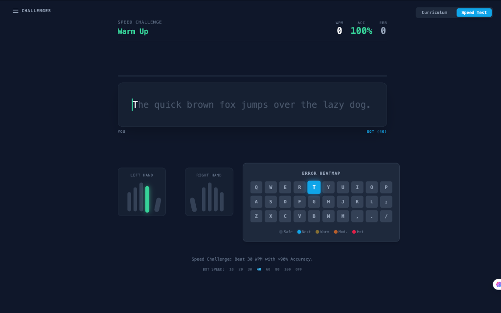
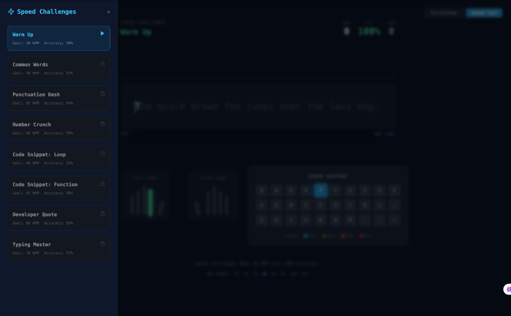
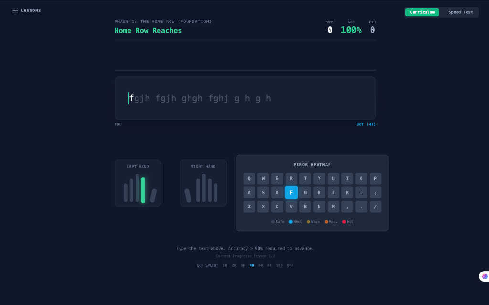
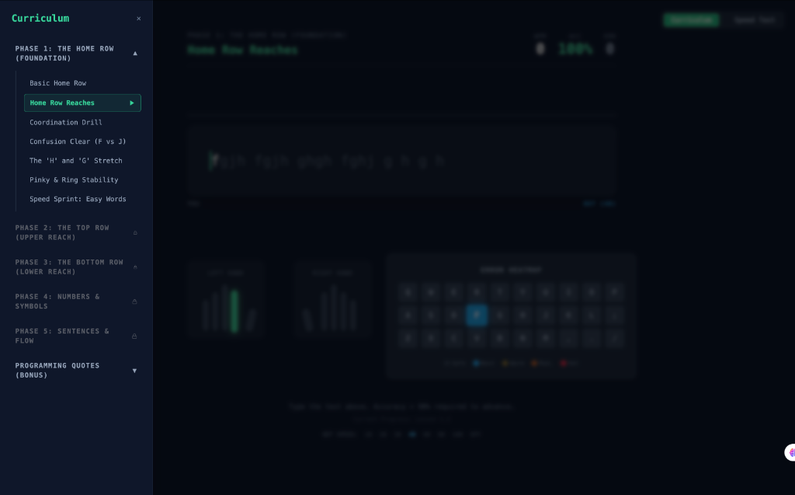

# Keystrokes.js - Premium Touch Typing Tutor



## Why Keystrokes? (The Motivation)

In the modern digital workspace, typing speed and accuracy are crucial for productivity. This project was developed to provide a high-performance practice environment for mastering touch typing.

Building Keystrokes helped me solidify my understanding of:
- **Real-time Performance**: Handling high-frequency input events without UI lag.
- **Complex UI Logic**: Implementing dynamic keyboard heatmaps and visual hand indicators.
- **Micro-Animations**: Using Framer Motion to create a premium, reactive user experience.

---

## What is Keystrokes.js?

Keystrokes.js is a high-fidelity, responsive typing tutor interface. It's a showcase of clean design and efficient frontend logic geared toward serious practice.

### Key Features
- **Structured Curriculum**: Progressive phases from Home Row basics to complex programming quotes.
- **Speed Challenges**: Dynamic challenges including common words, punctuation, and code snippets.
- **Real-time Stats**: Instant visual feedback on WPM (Words Per Minute), Accuracy, and Error count.
- **Visual Feedback**: Real-time hand indicators and a dynamic "Error Heatmap" to identify problem areas.
- **Fully Responsive**: Optimized layouts for all screen sizes, ensuring a seamless practice experience.

### Tech Stack
- **Library**: React.js
- **Styling**: Tailwind CSS
- **Animations**: Framer Motion
- **Icons**: Lucide React
- **Build**: Vite

---

## Project Structure

```text
src/
├── components/
│   ├── Hands.jsx                 (Virtual hand indicators)
│   ├── KeyboardHeatmap.jsx       (Real-time error analysis)
│   ├── LessonSelector.jsx        (Curriculum navigation)
│   ├── ResultsModal.jsx          (Performance summaries)
│   ├── SpeedTestSelector.jsx     (Challenge selection)
│   ├── StatsDisplay.jsx          (WPM and Accuracy tracks)
│   └── TypingArea.jsx            (Core interaction engine)
├── data/
│   └── curriculum.js             (Structured lesson dataset)
├── hooks/
│   ├── useCurriculum.js          (Lesson state management)
│   └── useTypingEngine.js        (Real-time input logic)
├── utils/
│   └── typingUtils.js            (Helper functions)
├── App.jsx                       (Root application)
├── main.jsx                      (Entry point)
└── index.css                     (Global styling)
```

---

## Project Showcase

| Speed Challenges | Structured Lessons | Visual Curriculum |
| :---: | :---: | :---: |
|  |  |  |

---

## How to Run

To get this project running on your local machine, follow these steps:

### 1. Clone the repository
```bash
git clone https://github.com/All-Projects-Products/Keystrokes.js.git
cd Keystrokes.js
```

### 2. Install dependencies
Ensure you have Node.js installed, then run:
```bash
npm install
```

### 3. Start the development server
```bash
npm run dev
```
The app will be available at `http://localhost:5173`.

---

Designed and Developed with focus on Frontend Excellence.
